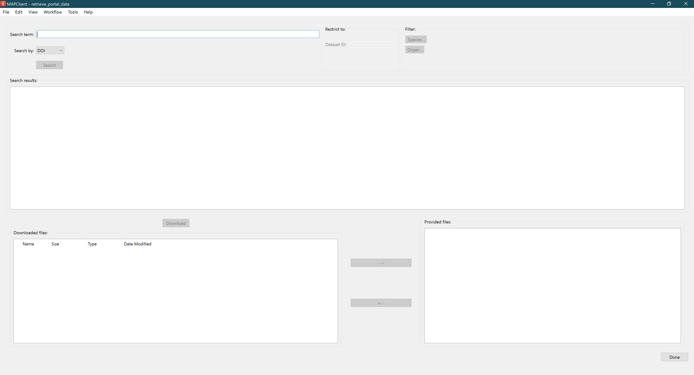
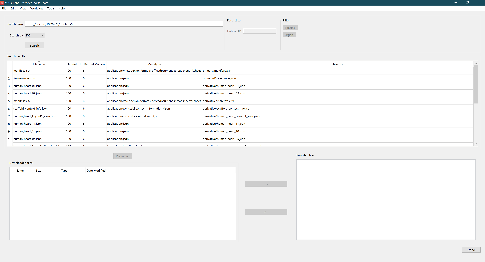
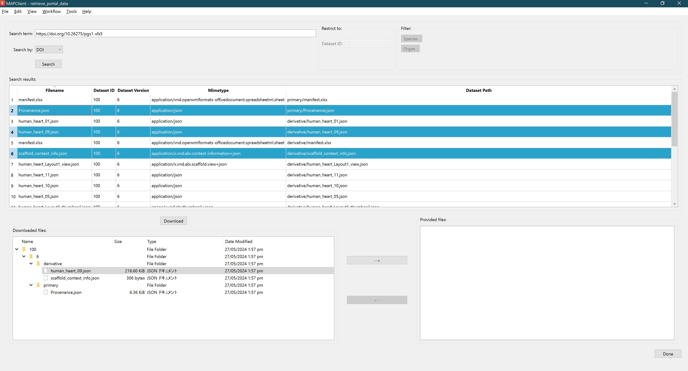
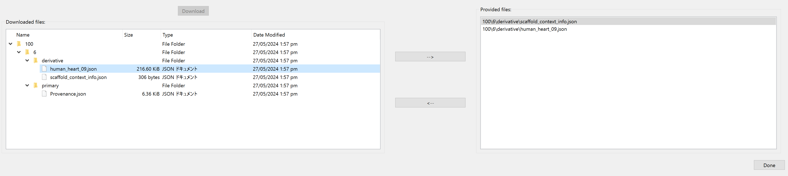

Retrieve Portal Data
====================

Overview
--------

The **Retrieve Portal Data** is a MAP Client plugin that allows users to search for and download files in datasets from the SPARC portal using a DOI or other identifiers.

Specification
-------------

Information on this plugin's specifications is available :ref:`here <mcp-retrieve-portal-data-specification>`.

Configuration
-------------

Information on this plugin's configuration is available :ref:`here <mcp-retrieve-portal-data-configuration>`.

Instructions
------------

After configuring the plugin and executing the workflow, the main interface of the plugin appears,
which includes sections for searching, downloading, and setting the files to be provided to other steps.

.. _fig-mcp-retrieve-portal-data-initial-interface:

   *Retrieve Portal Data* initial interface.

Search Data
+++++++++++

To search for data, follow these steps:

.. _fig-mcp-retrieve-portal-data-search-doi:

   Search by DOI.

1. **Select Search By Type**: Choose the search by type from the `Search by` dropdown (e.g., DOI).
2. **Enter Search Term**: Input your search term in the `Search term` field.
3. **Execute Search**: Click `Search` to run the search query.

.. note::
    The plugin is currently only able to display search results for the newest versions of the dataset.
    Older versions of a dataset with a valid DOI will return no results.

If the `search by` type is `filename`,
you can further refine your search by restricting it to a specific dataset ID.

.. _fig-mcp-retrieve-portal-data-search-filename:

.. figure:: _images/search-filename.png
   :alt: Search by filename.

   Search by filename.

Searching by mimetype allows you to apply filters for species and organ.
You must use a full mimetype this search does not do a simple text based search.

.. _fig-mcp-retrieve-portal-data-search-mimetype:

.. figure:: _images/search-mimetype.png
   :alt: Search by mimetype.

   Search by mimetype.

Download Data
+++++++++++++

Once you have your search results, follow these steps to download the data:

.. _fig-mcp-retrieve-portal-data-download-files:

   Download files.

1. **View Search Results**: The search results will populate in the `Search results` area.
Browse through the results to find the files you need.
2. **Select Files**: Choose the files you wish to download from the search results.
3. **Download Files**: Click `Download` to download the selected files to the specified output directory.
Downloaded files will be listed in the `Downloaded files` section, showing details such as name, size, type, and date modified.

Using the Data
++++++++++++++

After downloading the files, you can select which files are needed for the subsequent steps of your workflow.

.. _fig-mcp-retrieve-portal-data-downloaded-files:

   Downloaded files.

Use the arrow buttons (`-->` and `<--`) to move files between the `Downloaded files` and `Provided files` sections.
Files in the `Provided files` section are the ones that will be given to the subsequent steps of your workflow.

.. note::
    Ensure you have a stable internet connection to download data from the portal.
    Verify the integrity and relevance of the downloaded data before proceeding with your workflow.
    By following these steps, you can effectively search for, download, and integrate data from external portals into your MAPClient workflows using the Retrieve Portal Data plugin.

Finishing
~~~~~~~~~
Once you have moved the necessary files to the `Provided files` section,
click `Done` to finalize the step. This will execute any additional workflow steps
connected to the **Retrieve Portal Data** step.

.. toctree::
  :hidden:
  :caption: Retrieve Portal Data
  :maxdepth: 1

  specification.rst
