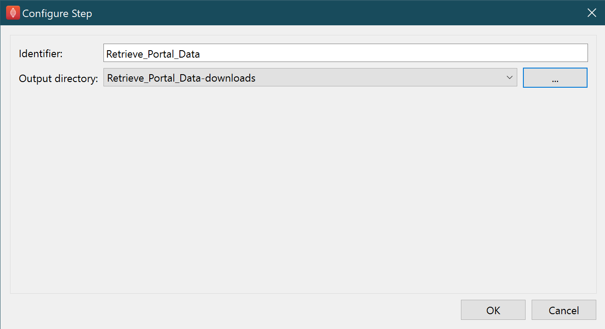

Retrieve Portal Data
====================

Overview
--------

The **Retrieve Portal Data** is a MAP Client plugin that use the sparc.client to retrieve scaffold datasets from the SPARC portal.

Specification
-------------

Information on this plugin's specifications is available :ref:`here <mcp-retrieve-portal-data-specification>`.

Configuration
-------------

This step is used for downloading files from the SPARC portal and providing them as a list of filenames.
To set the location to save the file to use the … button to open a file chooser dialog.
The Output directory is used to hold the relative path from the workflow to the downloaded file location.

.. _fig-mcp-retrieve-portal-data-configure-dialog:

   *Retrieve Portal Data* step configuration dialog.

Instructions
------------

Utilize keyword search and filters to identify datasets matching your mapping needs
and apply additional filters if needed to refine your search.

Python client search tool with a search term of _mice_ and a refinement to only search dataset 314.

Select desired files: Choose the files you need from the search results list.
Click the download button: Initiate the download process. The download button will download the selected file to
your local computer.

Python client search tool highlighting a selected entry in a query response, and the Download button.

Finishing
~~~~~~~~~
Clicking the `Done` button will execute any additional workflow steps
connected to the **Retrieve Portal Data** step.

.. toctree::
  :hidden:
  :caption: Retrieve Portal Data
  :maxdepth: 1

  specification.rst

